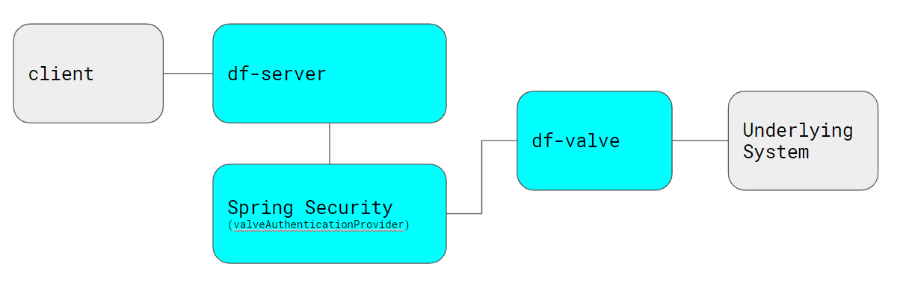

##############
Authentication
##############

**NOTE:** Drillflow handles Authentication NOT Authorization. Authorization is the responsibly of the underlying system, not Drillflow.

************
Introduction
************

As can be seen in the diagram above, **df-server** leverages Spring security to handle authentication. This is done via the
`ValveAuthenticationProvider <https://github.com/hashmapinc/Drillflow/blob/master/df-server/src/main/java/com/hashmapinc/tempus/witsml/server/api/ValveAuthenticationProvider.java>`_. Spring Security is
configured to use this authentication provider which calls the **authenticate()** method of `IValve <https://github.com/hashmapinc/Drillflow/blob/master/df-valve/src/main/java/com/hashmapinc/tempus/witsml/valve/IValve.java>`_.
The authenticate method is responsible for executing the necessary elements to authenticate with the underlying system.

*********************
WITSML Authentication
*********************
It needs to be noted at this point that version 1.3.1.1 and 1.4.1.1 (the currently supported versions of the API) only support HTTP BASIC authentication.
This means that whatever authentication system that the underlying system has, must be able to handle a username and password combination. This poses issues
with most modern solutions. In this section we will aim to propose some solutions to common integrations.

*********************

*********************

