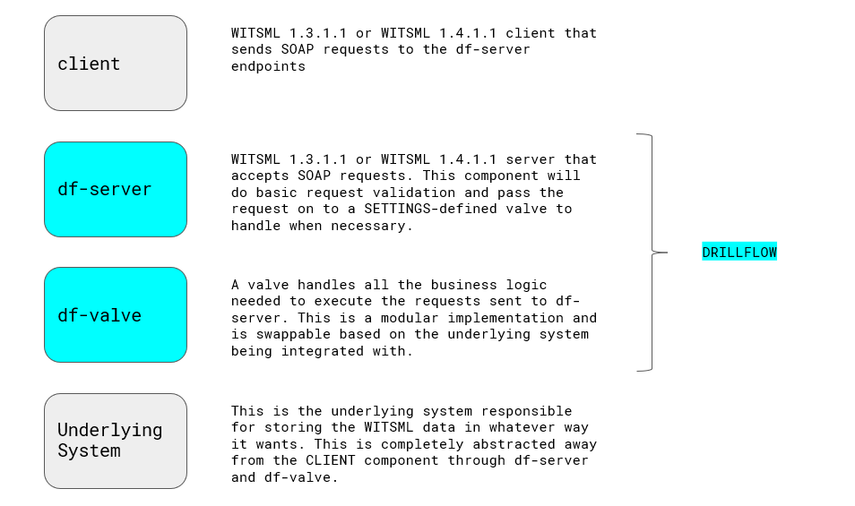
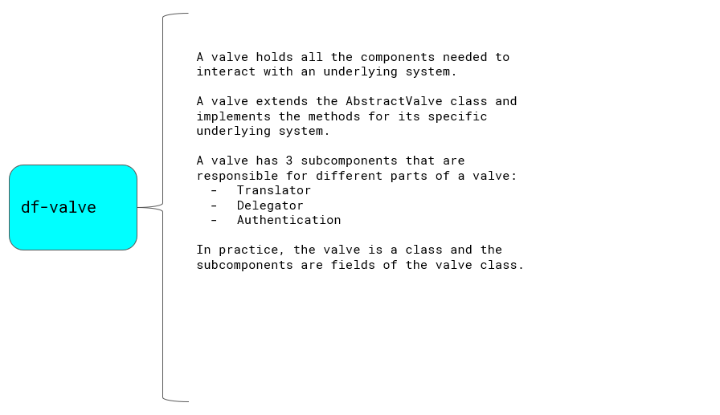
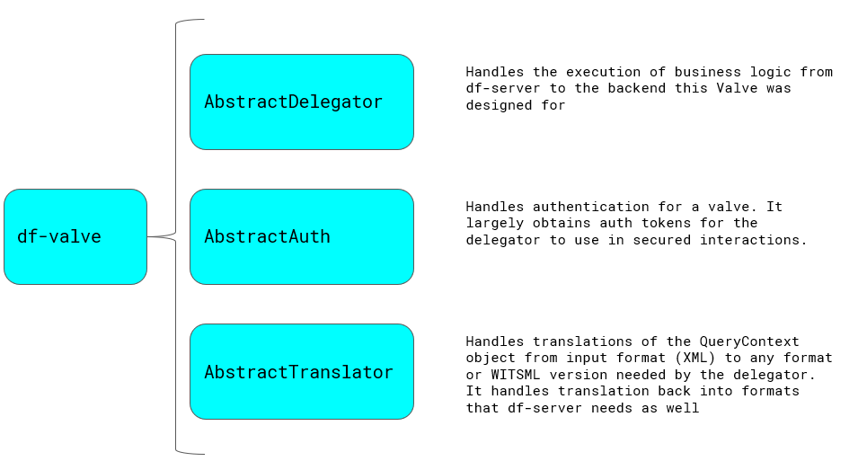

#####################
Solution Architecture
#####################

.. _solution_arch:

************
Introduction
************

=================
What is Drillflow
=================

Drillflow is an API facade that allows Oil and Gas software systems that currently expose drilling data to
leverage WITSML to exchange data between other software systems and vendors. It is packaged as a docker image or a
Spring Boot application to allow for minimum hassle at deploy time. It is also intended to be extensible and
horizontally scalable to handle everything from a one time bulk load to a streaming application.

========
WHY?!?!?
========
WITSML servers have been implemented in many forms and fashions over the relatively long lifespan of
WITSML. The point of Drillflow is to ease the burden for software developers and system integrators to
make use of WITSML data. Our goal is that if we can get this hurdle out of the way quicker, time to value
is reduced.

Our goal was to implement a WITSML server on a modern stack: Java 11, Spring Boot with CXF, deployed with
docker.

===================
So How does it Work
===================
As stated in the "What is..." section above, Drillflow is an API facade. So what does this mean, exactly?
Drillflow does not have any data persistance, or traditional transactional logic. What it does do is sit in
front of a REST/Thrift/Protobuf/etc... API that will allow for data to be accessed via the WITSML data
model and semantics.

*************
Core Concepts
*************
There are a few key concepts to understand in Drillflow. First are the major components:

* **df-server**: This is the WITSML SOAP API exposed via Tomcat and CXF, also the application server
* **df-valve**: This is the extensibility point that allows Drillflow to proxy WITSML commands to another system

The valve is further broken into two key pieces:

* **Translator**: The part of the valve that allows the actual body of the commands to be translated between df-server and the underlying system
* **Delegator**: The part of the valve that is responsible for actually executing the command on the underlying system and returning the response to the valve so that it can be returned to df-server

Let's dig into these a little further in the next session:

======
Server
======

To be clear, there is really not much in this part that needs to be modified. Overall this solution is responsible for
handling WITSML specific exchanges with a client. This, currently, can handle WITSML 1.4.1.1 and 1.3.1.1 schema versions and
conforms to the 1.2.0 WSDL. Overall this portion of the server is directly responsible for the 3 required WITSML functions:

* GetBaseMsg
* GetVersion
* GetCap

Each one of these is defined mostly by properties files that can be modified at deploy time either by passing environement variables,
passing a properties file, or Java system properties. Overall this is really managed by Spring so any of the options listed
`Here <https://docs.spring.io/spring-boot/docs/current/reference/html/boot-features-external-config.html/>`_.

The one notable exception is GetCap. The contact information, server metadata (name, etc...) is from a properties file, however,
the actual function capabilities are advertised to df-server via the Valve. There is a function that allows the valve to notify, df-server
what functions, and what data object for each function is available. This is a key point, as this allows the Valve to have full-control
over the objects and functions that it wants to support. This is not imposed on the underlying system by df-server. This leads us into our next discussion:
The valve.

=====
Valve
=====

As seen in the image above, the valve is an encapsulation of all the elements required to communicate with an underlying system.

*NOTE: There is one main thing that need to be noted about this...Class loader isolation...there is none. Therefore dependency conflicts are possible
if care is not taken. This is something that might be addressed in the future, but at the moment that complexity is not warranted for this solution, yet.*

The valve consists of three components:

* Authenticator
* Translator
* Delegator

These can be seen along with their descriptions in the image below:

As seen in the diagram above, each component of the valve is defined as an abstract class that can then be implemented by the
valve implementation.

There is a distinct difference between the Translator/Delegator and the Authenticator. The Authenticator is used via a
custom authentication provider, the `ValveAuthenticationProvider <https://github.com/hashmapinc/Drillflow/blob/master/df-server/src/main/java/com/hashmapinc/tempus/witsml/server/api/ValveAuthenticationProvider.java>`_.
This is called during the authentication flow of Tomcat as a function is called. The main purpose of this design is to allow the
underlying solution to implement whatever authentication it sees fit. There is a more detailed section on authentication patterns
in a separate section located **here**.

The Translator and Delegator components are only invoked through an actual query chain initiated by a client calling a function of the WITSML API in
**df-server**.

